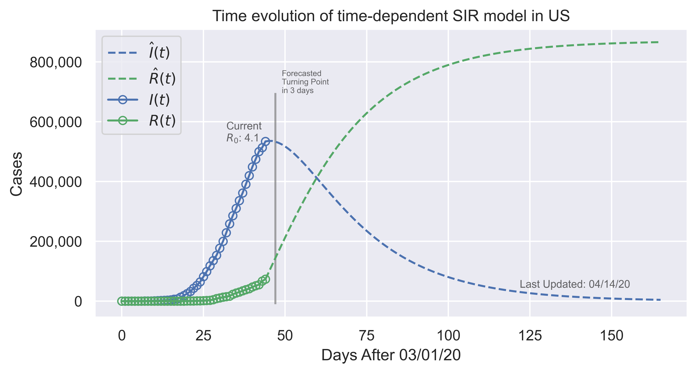

# Getting started with COVID-19
The purpose of this project is to provide basic tools for data cleaning, visualization, and modelling COVID-19 data in Python.

## Data Sources
This project uses live data from the [Johns Hopkins CSSE Data Repository](https://github.com/CSSEGISandData/COVID-19) of global COVID-19 cases, and the [New York Times](https://github.com/nytimes/covid-19-data) data collection for US State and county-level data. Testing data is pulled from [The Covid Tracking Project](https://covidtracking.com/), associated with The Atlantic.

## Usage
[data_clean.py](data_clean.py) provides some useful functions to process data from both sources, and begin with a clean dataframe containing daily confirmed case counts for each region. Basic examples visualizations are shown [here](testing_viz.ipynb).

## Modeling
[regression_model.ipynb](regression_model.ipynb) has a lot of quick visualizations and regressions ranging from logistic / exponential fits to recent growth rate values. A good number of these analyses were adapted from other sources, links provided within the notebook.

[SIR_time_dependent_US.ipynb](SIR_time_dependent_US.ipynb) is an adaptation from [this paper](https://arxiv.org/abs/2003.00122), which models Chinese infections using a time-dependent deterministic SIR model. This models expands upon a basic SIR model using Johns Hopkins data for the US, and parameterizes $\beta$ and $\gamma$ as a function of time. The simulation from the paper is replicated here: [SIR_time_dependent_China.ipynb](SIR_time_dependent_China.ipynb).

## Visualizations
[confirmed_cases.ipynb](confirmed_cases.ipynb) contains visualizations that track current progress of testing and confirmed case counts at the international and US state level. Comment out `renderer='svg'` in `fig.show()` to return an interactive plotly chart instead of the static image.s

## Dependencies
A full list of Python dependencies are listed in the [requirements.txt](requirements.txt).
